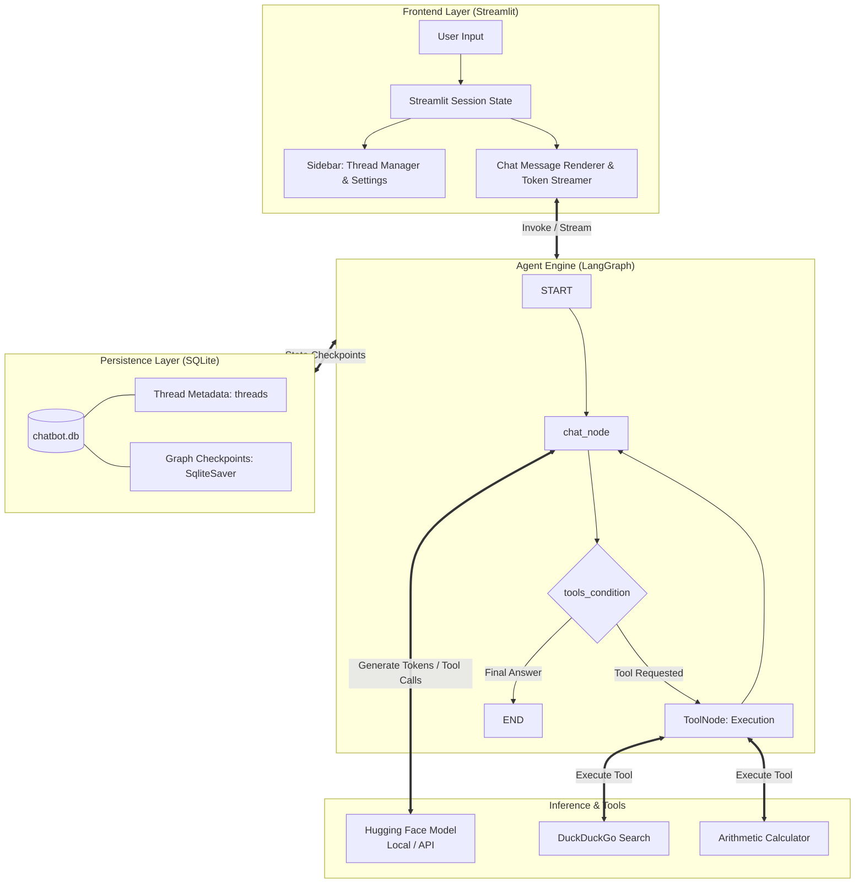

# LangGraph Conversational AI Agent

[](https://www.python.org/)
[](https://github.com/langchain-ai/langgraph)
[](https://streamlit.io/)
[](https://pytorch.org/)
[](https://huggingface.co/Qwen/Qwen2.5-3B-Instruct)
[](LICENSE)

An enterprise-ready, stateful conversational AI assistant powered by **LangGraph**, **LangChain**, and **Streamlit**. Designed with a modular ReAct agent architecture, persistent SQLite checkpointing, multi-thread conversation management, external tool execution (real-time web search and mathematics), and optimized local Hugging Face inference with 4-bit quantization.

---

## Table of Contents

- [Key Features](#key-features)
- [System Architecture](#system-architecture)
- [Project Directory Structure](#project-directory-structure)
- [Prerequisites](#prerequisites)
- [Installation & Quickstart](#installation--quickstart)
  - [Automated Setup (Windows)](#option-a-automated-setup-windows)
  - [Manual Setup](#option-b-manual-setup)
- [Configuration Guide](#configuration-guide)
  - [Environment Variables (`.env`)](#environment-variables-env)
  - [Model Selection & Hyperparameters](#model-selection--hyperparameters)
  - [Adding Custom Tools](#adding-custom-tools)
- [Database Schema & Memory Management](#database-schema--memory-management)
- [Troubleshooting & FAQ](#troubleshooting--faq)
- [Contributing](#contributing)
- [License](#license)

---

## Key Features

- **Stateful Multi-Turn Conversations:** Powered by LangGraph's compiled `StateGraph` and `SqliteSaver` checkpointer. State is persisted across server reboots, page refreshes, and thread switches.
- **Dynamic Tool Calling & Agentic Loop:** Features automated ReAct conditional loops (`tools_condition`) that trigger specialized capabilities when required:
  - **Live Web Search:** Real-time internet search via DuckDuckGo.
  - **Arithmetic Calculator:** Precise numeric computations with error boundary handling.
  - **Extensible Registry:** Automatic discovery of any tool files dropped into `backend/tools/`.
- **Hardware-Optimized Local Inference:**
  - Configured for **`Qwen/Qwen2.5-3B-Instruct`**, balancing quality, reasoning, and resource efficiency.
  - **4-Bit NF4 Quantization** via `bitsandbytes` reducing VRAM requirements to ~2GB.
  - Seamless toggle between local Hugging Face pipelines (`HuggingFacePipeline`) and cloud-hosted inference endpoints (`HuggingFaceEndpoint`).
- **Interactive Multi-Thread UI:**
  - Sidebar conversation history with instant creation, renaming, selection, and deletion of threads.
  - Interactive "New Chat" and "Rename" modal dialogs with auto-focus form controls.
  - Live temperature slider for fine-tuning model creativity vs. tool determinism.
- **Real-Time Token Streaming:**
  - Streaming responses rendered token-by-token using `chatbot.stream(..., stream_mode='messages')`.
  - Visual indicators for active tool calls (`🛠️ Using tool...`) and execution results (`✔️ Tool returned...`).
- **Production-Grade Fault Tolerance:**
  - **Centralized Precision Logging:** Every log message shows the exact file, function, and line number.
  - SQLite WAL (Write-Ahead Logging) mode and exponential backoff retries to prevent database deadlocks.
  - Lazy factory instantiation for the chatbot model to recover gracefully from misconfigurations.

---

## System Architecture



---

## Project Directory Structure

The project has been modularized into highly focused sub-packages:

```plaintext
ChatBot-in-LangGraph/
│
├── backend/                      # Core agent logic and inference services
│   ├── bot/                      # ChatBot class and lazy cache factory
│   ├── config/                   # Config loading, validation, and CLI selector
│   ├── db/                       # SQLite connection and thread operations
│   ├── graph/                    # LangGraph state machine, nodes, and parser
│   ├── model/                    # Hugging Face local & API model loader
│   ├── tools/                    # Auto-discovering tool registry
│   │   ├── __init__.py           # Discovers tools using pkgutil
│   │   ├── calculator.py         # Arithmetic calculator tool
│   │   └── search.py             # DuckDuckGo search tool
│   ├── constants.py              # Single source of truth for magic strings
│   ├── logger.py                 # Centralized precise logging setup
│   └── models.json               # Catalog of AI models, specs, and requirements
│
├── frontend/                     # Presentation and user interface
│   ├── state/                    # Session state, conversation loaders, thread management
│   └── ui/                       # Sidebar, dialogs, and chat stream rendering
│
├── .env.example                  # Template for sensitive credentials and API tokens
├── .gitignore                    # Git tracking exemptions
├── app.py                        # Main Streamlit application entry point
├── CodeStructure.md              # Project coding conventions and style guide
├── config.json                   # General project configurations & settings
├── README.md                     # Comprehensive project documentation
├── requirements.txt              # Categorized project dependencies (CUDA 12.6)
└── run.bat                       # Automated Windows launcher and venv manager
```

---

## Prerequisites

Before starting, ensure your system meets the following specifications:

| Requirement | Minimum | Recommended |
| :--- | :--- | :--- |
| **Operating System** | Windows 10/11, Ubuntu 20.04+, or macOS | Windows 11 / Linux (64-bit) |
| **Python Version** | Python 3.10 | Python 3.11 or 3.12 |
| **RAM** | 8 GB System Memory | 16 GB System Memory |
| **GPU (Optional)** | CPU-only mode supported | NVIDIA GPU with 4GB+ VRAM (CUDA 12.0+) |

---

## Installation & Quickstart

### Option A: Automated Setup (Windows)

The repository provides a self-healing `run.bat` script that verifies your Python installation, provisions a virtual environment, installs dependencies, and launches the application:

1. Clone the repository:
   ```bash
   git clone https://github.com/Mr-Rup/ChatBot-in-LangGraph.git
   cd ChatBot-in-LangGraph
   ```
2. Double-click `run.bat` (or execute it via Command Prompt / PowerShell):
   ```cmd
   .\run.bat
   ```
3. The script will automatically configure the `.myenv` environment and open the Streamlit interface at `http://localhost:8501`.

---

### Option B: Manual Setup

1. **Clone the Repository:**
   ```bash
   git clone https://github.com/Mr-Rup/ChatBot-in-LangGraph.git
   cd ChatBot-in-LangGraph
   ```

2. **Create and Activate a Virtual Environment:**
   - **Windows:**
     ```cmd
     python -m venv .myenv
     .myenv\Scripts\activate
     ```
   - **Linux / macOS:**
     ```bash
     python3 -m venv .myenv
     source .myenv/bin/activate
     ```

3. **Install PyTorch with CUDA Support:**
   If you have an NVIDIA GPU, install PyTorch with CUDA 12.6 acceleration first:
   ```bash
   pip install torch torchvision --extra-index-url https://download.pytorch.org/whl/cu126
   ```

4. **Install Remaining Dependencies:**
   ```bash
   pip install -r requirements.txt
   ```

5. **Configure Environment Variables (Optional):**
   ```bash
   copy .env.example .env     # Windows
   cp .env.example .env       # Linux / macOS
   ```

6. **Launch the Application:**
   ```bash
   streamlit run app.py
   ```

---

## Configuration Guide

The project adopts a strict separation between **sensitive credentials**, **application runtime settings**, and **AI model specifications**.

### 1. Sensitive Credentials (`.env`)

The `.env` file is restricted strictly to private tokens and secrets. Copy `.env.example` to `.env`:

```env
# Hugging Face Access Token (Required for API models or gated repos like Llama)
HUGGINGFACEHUB_API_TOKEN=your_huggingface_api_token_here

# LangSmith API Key (Required only if langsmith tracing is enabled in config.json)
LANGCHAIN_API_KEY=your_langsmith_api_key_here
```

---

### 2. General Project Settings (`config.json`)

All non-sensitive application settings (cache directories, database paths, LangSmith toggles, and system prompts) are controlled centrally in `config.json`:

```json
{
  "active_model": "qwen-2.5-3b",
  "llm_cache_dir": null,
  "database_path": "chatbot.db",
  "langsmith": {
    "tracing": false,
    "project": "ChatBot-LangGraph",
    "endpoint": "https://api.smith.langchain.com"
  },
  "system_prompt": "You are a highly capable AI assistant with access to external tools. You MUST use these tools when asked to perform math, search, or look up information. Do NOT refuse to use tools. Do NOT perform calculations yourself. Always output the correct JSON format to invoke the tool when needed."
}
```

---

### 3. Model Catalog & Specifications (`backend/models.json`)

All AI model definitions, hardware specifications, and parameters live cleanly in `backend/models.json`:

```json
{
  "qwen-2.5-3b": {
    "name": "Qwen 2.5 3B Instruct",
    "repo_id": "Qwen/Qwen2.5-3B-Instruct",
    "model_type": "local",
    "task": "text-generation",
    "temperature": 0.1,
    "max_new_tokens": 512,
    "specs": {
      "parameters": "3.09B",
      "vram_required": "~2.0 GB (4-bit quantized)",
      "ram_required": "8 GB",
      "tool_support": "High (Native function calling & tool precision)"
    },
    "description": "Recommended. Outstanding balance of deep reasoning, concise answers, and tool-use reliability."
  }
}
```

#### Pre-Configured Models
1. **Qwen 2.5 3B Instruct** (`qwen-2.5-3b`): *Default*. Outstanding reasoning and reliable tool-calling precision (~2GB VRAM).
2. **TinyLlama 1.1B Chat** (`tiny-llama-1.1b`): Ultra-lightweight and fast, runs on virtually any PC/laptop (~1GB VRAM).
3. **Qwen 2.5 1.5B Instruct** (`qwen-2.5-1.5b`): Great balance of speed and instruction following (~1.2GB VRAM).
4. **Qwen 2.5 0.5B Instruct** (`qwen-2.5-0.5b`): Ultra-compact, ideal for CPU-only and testing (<1GB VRAM).
5. **Llama 3.2 1B Instruct** (`llama-3.2-1b`): Edge-optimized multilingual model (Requires HF token in `.env`).
6. **Phi 3.5 Mini Instruct** (`phi-3.5-mini`): Microsoft's strong mathematical and reasoning model (~2.5GB VRAM).

#### Selecting Models
- **At Launch (Interactive CLI):** When executing `run.bat`, an interactive menu prompts you to either keep the active model or select a new one from the list.
- **In Streamlit UI:** The sidebar automatically displays the active model's name, parameter count, hardware requirements, and tool capability.
- **Manually:** Change the `"active_model"` key directly in `config.json`.

---

### Adding Custom Tools

The project uses a self-registering tool discovery system. Adding new capabilities to the chatbot is fully automated.

1. Create a new file in the `backend/tools/` directory (e.g., `backend/tools/stock_price.py`).
2. Define your tool using the `@tool` decorator.
3. Expose a `TOOLS` list at the bottom of the file.

```python
from langchain_core.tools import tool, BaseTool

@tool
def get_stock_price(ticker: str) -> dict:
    """Fetch the latest stock price for a given stock ticker symbol."""
    return {"ticker": ticker, "price": 182.50}

# The tools/__init__.py auto-discovers this list!
TOOLS: list[BaseTool] = [get_stock_price]
```

That's it! The system will automatically find your tool, bind it to the LLM, and execute it when requested. You don't need to change any other file.

---

## Database Schema & Memory Management

All session and conversation history is persisted in a local SQLite database (`chatbot.db`) configured with **WAL (Write-Ahead Logging)** mode and automated backoff retries for concurrent read/write stability.

### Tables

1. **`threads`** (Managed by `backend/db/threads.py`):
   - `thread_id` *(TEXT, PRIMARY KEY)*: Unique thread identifier (e.g., `thread1`, `thread2`).
   - `thread_name` *(TEXT)*: User-defined label displayed in the sidebar.
   - `updated_at` *(TIMESTAMP)*: Tracks the most recently active conversations.

2. **`checkpoints` & `writes`** (Managed by `SqliteSaver`):
   - Stores serialized LangGraph states, checkpoint snapshots, and message histories.
   - Deleting a thread via the UI triggers a cascading cleanup that removes both thread metadata and associated checkpoints to save disk space.

---

## Troubleshooting & FAQ

<details>
<summary><b>1. CUDA Out of Memory (OOM) error during local model loading</b></summary>

- **Solution:** Verify `bitsandbytes` is installed to ensure 4-bit quantization is active. If your GPU has less than 4GB VRAM, switch `'model_type': 'api'` in `backend/models.json` or use a smaller base model like `Qwen/Qwen2.5-1.5B-Instruct` or `Qwen/Qwen2.5-0.5B-Instruct`.
</details>

<details>
<summary><b>2. DuckDuckGo Search fails with rate limit errors</b></summary>

- **Solution:** Ensure `duckduckgo-search` is up to date:
  ```bash
  pip install --upgrade duckduckgo-search
  ```
</details>

<details>
<summary><b>3. SQLite database is locked (OperationalError)</b></summary>

- **Solution:** WAL mode is enabled and there is automatic backoff-retry logic in place. However, ensure no external SQLite browser has locked the file in exclusive mode.
</details>

<details>
<summary><b>4. Changing model download cache directory</b></summary>

- **Solution:** Edit `config.json` and change `"llm_cache_dir": null` to the absolute path of your choice (e.g., `"S:/ollama_models"`). If left `null`, Hugging Face will use its platform default (`~/.cache/huggingface`).
</details>

---

## Contributing

Contributions, issues, and feature requests are welcome!

1. Fork the Project
2. Create your Feature Branch (`git checkout -b feature/AmazingFeature`)
3. Commit your Changes (`git commit -m 'Add some AmazingFeature'`)
4. Push to the Branch (`git push origin feature/AmazingFeature`)
5. Open a Pull Request

Please adhere to the coding standards described in [CodeStructure.md](CodeStructure.md).

---

## License

Distributed under the MIT License. See `LICENSE` for more information.
