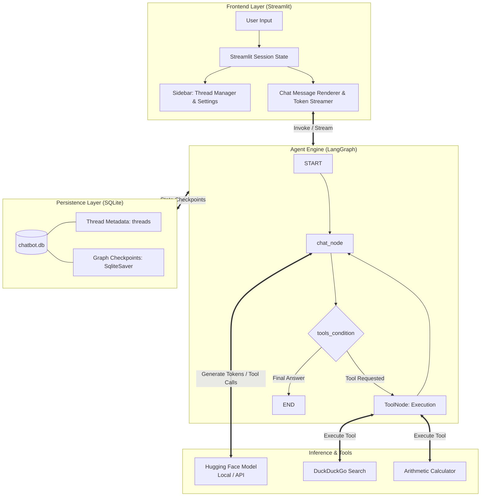

# LangGraph Conversational AI Agent

[](https://www.python.org/)
[](https://github.com/langchain-ai/langgraph)
[](https://streamlit.io/)
[](https://pytorch.org/)
[](https://huggingface.co/Qwen/Qwen2.5-3B-Instruct)
[](LICENSE)

An enterprise-ready, stateful conversational AI assistant powered by **LangGraph**, **LangChain**, and **Streamlit**. Designed with a modular ReAct agent architecture, persistent SQLite checkpointing, multi-thread conversation management, external tool execution (real-time web search and mathematics), and optimized local Hugging Face inference with 4-bit quantization.

---

## Table of Contents

- [Key Features](#key-features)
- [System Architecture](#system-architecture)
- [Project Directory Structure](#project-directory-structure)
- [Prerequisites](#prerequisites)
- [Installation & Quickstart](#installation--quickstart)
  - [Automated Setup (Windows)](#option-a-automated-setup-windows)
  - [Manual Setup](#option-b-manual-setup)
- [Configuration Guide](#configuration-guide)
  - [Environment Variables (`.env`)](#environment-variables-env)
  - [Model Selection & Hyperparameters](#model-selection--hyperparameters)
  - [Adding Custom Tools](#adding-custom-tools)
- [Database Schema & Memory Management](#database-schema--memory-management)
- [Troubleshooting & FAQ](#troubleshooting--faq)
- [Contributing](#contributing)
- [License](#license)

---

## Key Features

- **Stateful Multi-Turn Conversations:** Powered by LangGraph's compiled `StateGraph` and `SqliteSaver` checkpointer. State is persisted across server reboots, page refreshes, and thread switches.
- **Dynamic Tool Calling & Agentic Loop:** Features automated ReAct conditional loops (`tools_condition`) that trigger specialized capabilities when required:
  - **Live Web Search:** Real-time internet search via DuckDuckGo.
  - **Arithmetic Calculator:** Precise numeric computations with error boundary handling.
  - **Extensible Registry:** Automatic discovery of any decorated `@tool` functions.
- **Hardware-Optimized Local Inference:**
  - Configured for **`Qwen/Qwen2.5-3B-Instruct`**, balancing quality, reasoning, and resource efficiency.
  - **4-Bit NF4 Quantization** via `bitsandbytes` reducing VRAM requirements to ~2GB.
  - Seamless toggle between local Hugging Face pipelines (`HuggingFacePipeline`) and cloud-hosted inference endpoints (`HuggingFaceEndpoint`).
- **Interactive Multi-Thread UI:**
  - Sidebar conversation history with instant creation, selection, and deletion of threads.
  - Interactive "New Chat" modal dialog with auto-focus form controls.
  - Live temperature slider for fine-tuning model creativity vs. tool determinism.
- **Real-Time Token Streaming:**
  - Streaming responses rendered token-by-token using `chatbot.stream(..., stream_mode='messages')`.
  - Visual indicators for active tool calls (`🛠️ Using tool...`) and execution results (`✔️ Tool returned...`).
- **Production-Grade Fault Tolerance:**
  - Comprehensive `try/except` boundaries with detailed traceback logging across every module.
  - SQLite WAL (Write-Ahead Logging) mode and thread timeout safeguards to prevent database deadlocks.

---

## System Architecture



---

## Project Directory Structure

```plaintext
ChatBot-in-LangGraph/
│
├── backend/                      # Core agent logic and inference services
│   ├── __init__.py               # Backend package initialization
│   ├── bot.py                    # ChatBot orchestrator and default config
│   ├── db.py                     # SQLite connection and thread operations
│   ├── graph.py                  # LangGraph state machine, nodes, and edges
│   ├── model.py                  # Hugging Face local & API model loader
│   └── tools.py                  # Extensible tool registry and definitions
│
├── frontend/                     # Presentation and user interface
│   ├── __init__.py               # Frontend package initialization
│   ├── state.py                  # Streamlit session state and thread management
│   └── ui.py                     # Sidebar, dialogs, and chat stream rendering
│
├── .env.example                  # Template for environment variables and API keys
├── .gitignore                    # Git tracking exemptions
├── app.py                        # Main Streamlit application entry point
├── CodeStructure.md              # Project coding conventions and style guide
├── README.md                     # Comprehensive project documentation
├── requirements.txt              # Categorized project dependencies (CUDA 12.6)
└── run.bat                       # Automated Windows launcher and venv manager
```

---

## Prerequisites

Before starting, ensure your system meets the following specifications:

| Requirement | Minimum | Recommended |
| :--- | :--- | :--- |
| **Operating System** | Windows 10/11, Ubuntu 20.04+, or macOS | Windows 11 / Linux (64-bit) |
| **Python Version** | Python 3.10 | Python 3.11 or 3.12 |
| **RAM** | 8 GB System Memory | 16 GB System Memory |
| **GPU (Optional)** | CPU-only mode supported | NVIDIA GPU with 4GB+ VRAM (CUDA 12.0+) |

---

## Installation & Quickstart

### Option A: Automated Setup (Windows)

The repository provides a self-healing `run.bat` script that verifies your Python installation, provisions a virtual environment, installs dependencies, and launches the application:

1. Clone the repository:
   ```bash
   git clone https://github.com/Mr-Rup/ChatBot-in-LangGraph.git
   cd ChatBot-in-LangGraph
   ```
2. Double-click `run.bat` (or execute it via Command Prompt / PowerShell):
   ```cmd
   .\run.bat
   ```
3. The script will automatically configure the `.myenv` environment and open the Streamlit interface at `http://localhost:8501`.

---

### Option B: Manual Setup

1. **Clone the Repository:**
   ```bash
   git clone https://github.com/Mr-Rup/ChatBot-in-LangGraph.git
   cd ChatBot-in-LangGraph
   ```

2. **Create and Activate a Virtual Environment:**
   - **Windows:**
     ```cmd
     python -m venv .myenv
     .myenv\Scripts\activate
     ```
   - **Linux / macOS:**
     ```bash
     python3 -m venv .myenv
     source .myenv/bin/activate
     ```

3. **Install PyTorch with CUDA Support:**
   If you have an NVIDIA GPU, install PyTorch with CUDA 12.6 acceleration first:
   ```bash
   pip install torch torchvision --extra-index-url https://download.pytorch.org/whl/cu126
   ```

4. **Install Remaining Dependencies:**
   ```bash
   pip install -r requirements.txt
   ```

5. **Configure Environment Variables (Optional):**
   ```bash
   copy .env.example .env     # Windows
   cp .env.example .env       # Linux / macOS
   ```

6. **Launch the Application:**
   ```bash
   streamlit run app.py
   ```

---

## Configuration Guide

### Environment Variables (`.env`)

Create a `.env` file in the root directory if you wish to use remote Hugging Face APIs or LangSmith tracing:

```env
# Hugging Face API Token (Required if using model_type='api' or gated models)
HUGGINGFACEHUB_API_TOKEN=your_huggingface_api_token_here

# Optional: LangSmith Tracing & Observability
LANGCHAIN_TRACING_V2=false
LANGCHAIN_API_KEY=your_langsmith_api_key_here
LANGCHAIN_PROJECT=ChatBot-LangGraph
```

---

### Model Selection & Hyperparameters

Model specifications are controlled via `DEFAULT_MODEL_CONFIG` in [`backend/bot.py`](file:///s:/ChatBot-in-LangGraph/backend/bot.py):

```python
DEFAULT_MODEL_CONFIG = {
    'model_type': 'local',                     # 'local' or 'api'
    'model_name': 'Qwen/Qwen2.5-3B-Instruct',  # HuggingFace repository ID
    'model_task': 'text-generation',           # Pipeline task
    'model_temperature': 0.1,                  # Determinism vs creativity
    'model_max_new_tokens': 512                # Max output length per step
}
```

- **Local Inference:** Quantized using 4-bit NormalFloat (`BitsAndBytesConfig`) on CUDA devices. Model weights are cached locally (customizable via `HF_HOME` in `backend/model.py`).
- **Cloud API Inference:** Switch `'model_type': 'api'` to use serverless endpoints without consuming local VRAM.

---

### Adding Custom Tools

Adding new capabilities to the chatbot is fully automated. Simply define a function decorated with `@tool` in [`backend/tools.py`](file:///s:/ChatBot-in-LangGraph/backend/tools.py):

```python
from langchain_core.tools import tool

@tool
def get_stock_price(ticker: str) -> dict:
    """
    Fetch the latest stock price for a given stock ticker symbol.

    Parameters
    ----------
    ticker : str
        The market ticker symbol (e.g., AAPL, MSFT).
    """
    # Custom business logic here...
    return {"ticker": ticker, "price": 182.50}
```

The `available_tools()` registry automatically scans and registers all decorated tools to the LangGraph node at startup.

---

## Database Schema & Memory Management

All session and conversation history is persisted in a local SQLite database (`chatbot.db`) configured with **WAL (Write-Ahead Logging)** mode for concurrent read/write stability.

### Tables

1. **`threads`** (Managed by [`backend/db.py`](file:///s:/ChatBot-in-LangGraph/backend/db.py)):
   - `thread_id` *(TEXT, PRIMARY KEY)*: Unique thread identifier (e.g., `thread1`, `thread2`).
   - `thread_name` *(TEXT)*: User-defined label displayed in the sidebar.
   - `updated_at` *(TIMESTAMP)*: Tracks the most recently active conversations.

2. **`checkpoints` & `writes`** (Managed by `SqliteSaver`):
   - Stores serialized LangGraph states, checkpoint snapshots, and message histories.
   - Deleting a thread via the UI triggers a cascading cleanup that removes both thread metadata and associated checkpoints to save disk space.

---

## Troubleshooting & FAQ

<details>
<summary><b>1. CUDA Out of Memory (OOM) error during local model loading</b></summary>

- **Solution:** Verify `bitsandbytes` is installed to ensure 4-bit quantization is active. If your GPU has less than 4GB VRAM, switch `'model_type': 'api'` in [`backend/bot.py`](file:///s:/ChatBot-in-LangGraph/backend/bot.py) or use a smaller base model like `Qwen/Qwen2.5-1.5B-Instruct` or `Qwen/Qwen2.5-0.5B-Instruct`.
</details>

<details>
<summary><b>2. DuckDuckGo Search fails with rate limit errors</b></summary>

- **Solution:** Ensure `duckduckgo-search` is up to date:
  ```bash
  pip install --upgrade duckduckgo-search
  ```
</details>

<details>
<summary><b>3. SQLite database is locked (OperationalError)</b></summary>

- **Solution:** WAL mode is enabled by default (`PRAGMA journal_mode=WAL;`) with a 10-second timeout. Ensure no external SQLite browser has locked the file in exclusive mode.
</details>

<details>
<summary><b>4. Changing model download cache directory</b></summary>

- **Solution:** Edit line 21 in [`backend/model.py`](file:///s:/ChatBot-in-LangGraph/backend/model.py):
  ```python
  os.environ['HF_HOME'] = 'path/to/your/custom/directory'
  ```
</details>

---

## Contributing

Contributions, issues, and feature requests are welcome!

1. Fork the Project
2. Create your Feature Branch (`git checkout -b feature/AmazingFeature`)
3. Commit your Changes (`git commit -m 'Add some AmazingFeature'`)
4. Push to the Branch (`git push origin feature/AmazingFeature`)
5. Open a Pull Request

Please adhere to the coding standards described in [CodeStructure.md](file:///s:/ChatBot-in-LangGraph/CodeStructure.md).

---

## License

Distributed under the MIT License. See `LICENSE` for more information.
